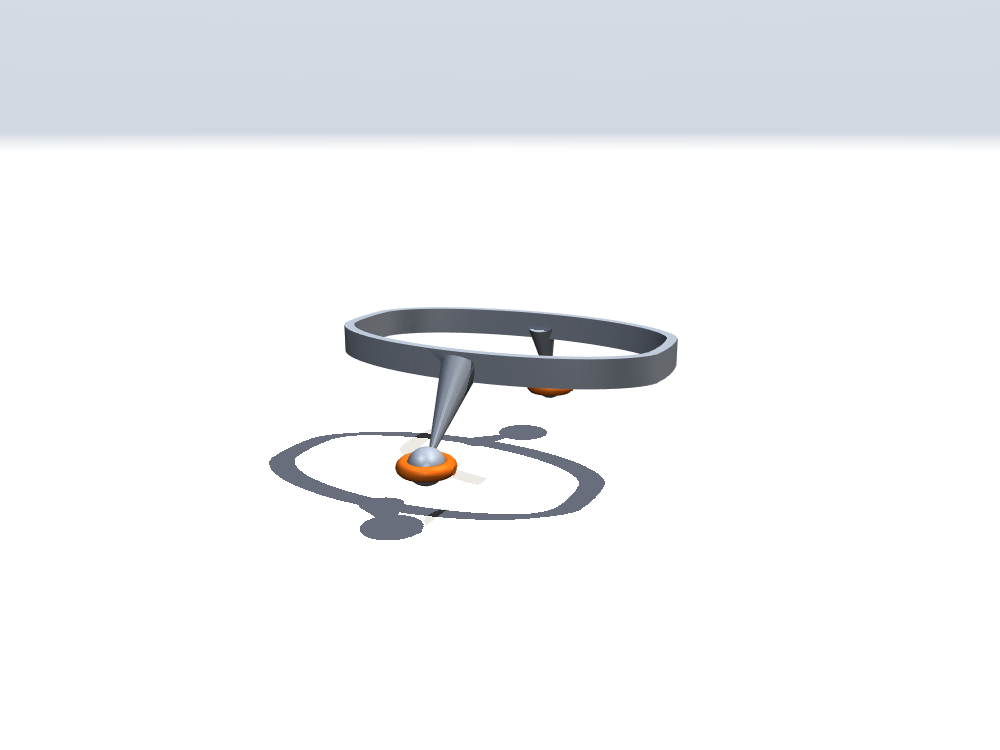

# Tug-of-war harness rig

Parametric, printable Microduck harness rig for the rope-tug demos: an
elliptical waist band clamped on the torso by the webbing harness, with a
tapered rear boss (butt carabiner, the pulled end) and a front boss (chest
carabiner, the pulling end), so the rope's force path runs through the duck
like a human puller's.

<table>
  <tr>
    <td></td>
    <td></td>
    <td></td>
  </tr>
</table>

## Files

- `source/cad_rig.py` — CAD pipeline (trimesh/manifold): band, bosses,
  carabiner with gate; all dimensions measured off the robot (see
  `src/mjlab_microduck/robot/tug_of_war.py` for the rope-side constants);
- `meshes/*_mm.stl` — millimetre-scale printable meshes;
- `../../src/mjlab_microduck/robot/microduck/assets/tug_frame.stl`,
  `tug_hook_carabiner.stl`, `tug_chest_carabiner.stl` — metre-scale MuJoCo
  visual meshes (water-tight, density-0 in the sim).
